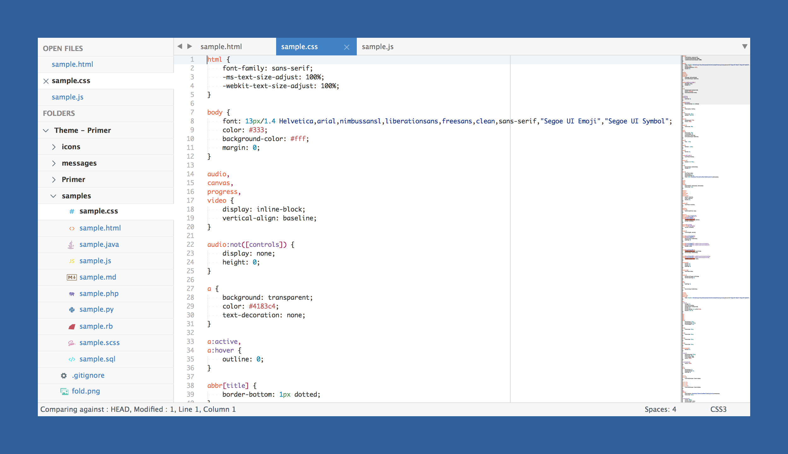
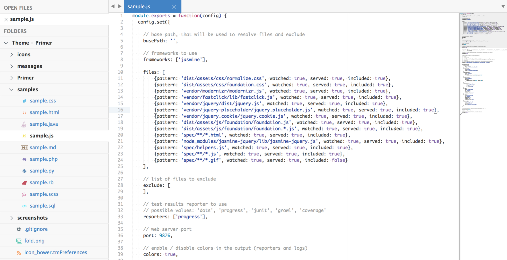
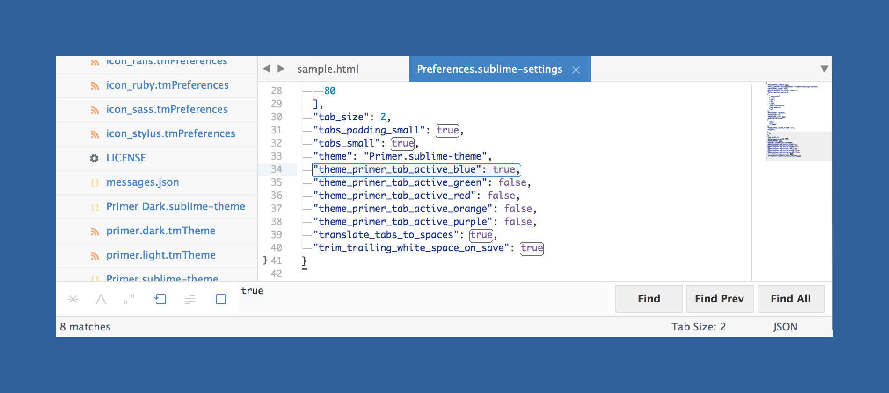
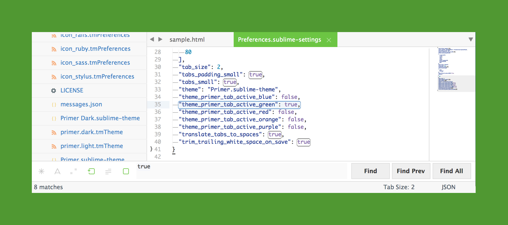
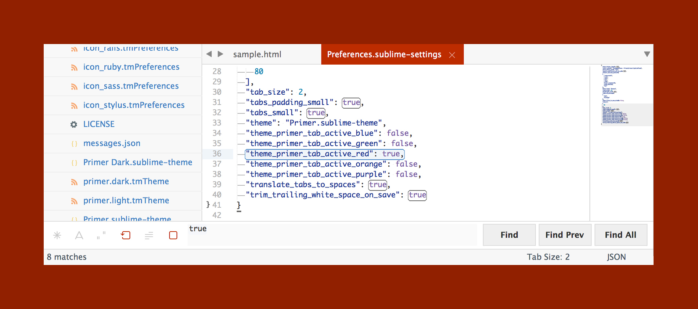
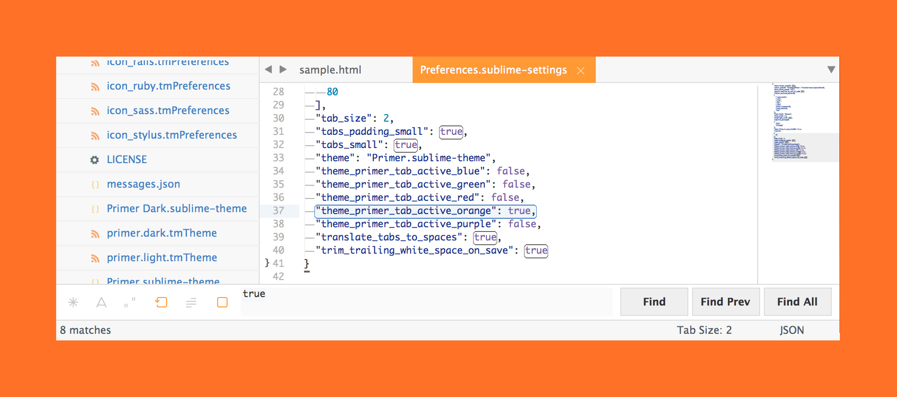

[](https://github.com/karelvuong/st-primer/releases/latest/)
[](https://github.com/karelvuong/st-primer/releases/)
[](https://github.com/karelvuong/st-primer/issues?utf8=✓&q=is%3Aissue+is%3Aopen)
[](https://github.com/karelvuong/st-primer/network/)
[](https://github.com/karelvuong/st-primer/stargazers/)
[](https://github.com/karelvuong/st-primer/watchers/)
[](https://packagecontrol.io/packages/Theme%20-%20Primer)
[](https://packagecontrol.io/packages/Theme%20-%20Primer)

# Primer

A custom UI and syntax theme for Sublime Text 2/3 that comes in, both, a light and dark variation. Based on GitHub's UI and design guidelines.

***

### Themes

#### Primer

Default flavor based on GitHub's UI.





*The font used in the screenshots is __Monaco__.*

***

### How to Install

#### Via Package Control

The easiest way to install is using [Sublime Package Control](https://sublime.wbond.net), where Primer is listed as `Theme - Primer`.

1. Open Command Palette using menu item `Tools -> Command Palette...` (<kbd>⇧</kbd><kbd>⌘</kbd><kbd>P</kbd> on Mac)
2. Choose `Package Control: Install Package`
3. Find `Theme - Primer` and hit <kbd>Enter</kbd>

#### Manual

You can also install the theme manually:

1. [Download the .zip](https://github.com/karelvuong/st-primer/archive/master.zip)
2. Unzip and rename the folder to `Theme - Primer`
3. Copy the folder into `Packages` directory, which you can find using the menu item `Sublime Text -> Preferences -> Browse Packages...`

***

### How to Activate

Activate the UI theme and color scheme by modifying your user preferences file, which you can find using the menu item `Sublime Text -> Preferences -> Settings - User` (<kbd>⌘</kbd><kbd>,</kbd> on Mac).

Primer comes with different accent colors based on GitHub's color scheme (http://primercss.io/colors/).

***Note: Don't forget to restart Sublime Text after activating the theme.***

***

### Settings for Primer

#### Light
```json
{
  "theme": "Primer.sublime-theme",
  "color_scheme": "Packages/Theme - Primer/primer.light.tmTheme"
}
```

#### Dark
```json
{
  "theme": "Primer Dark.sublime-theme",
  "color_scheme": "Packages/Theme - Primer/primer.dark.tmTheme"
}
```

#### Customization

Only choose one setting per section.

###### Accent Colors

Accent colors are used in a number of different places ranging from the active tab, matched text color in the quick panel, and others.

```json
{
  "theme_primer_tab_active_blue": true,

  "theme_primer_tab_active_green": true,
  "theme_primer_tab_active_red": true,
  "theme_primer_tab_active_orange": true,
  "theme_primer_tab_active_purple": true
}
```







###### Tab Height

```json
{
  "theme_primer_tabs_normal": true,

  "theme_primer_tabs_small": true,
  "theme_primer_tabs_large": true,
  "theme_primer_tabs_xlarge": true
}
```

###### Tab Font Size

```json
{
  "theme_primer_tabs_font_normal": true,

  "theme_primer_tabs_font_small": true,
  "theme_primer_tabs_font_large": true,
  "theme_primer_tabs_font_xlarge": true
}
```

###### Sidebar Row Padding

```json
{
  "theme_primer_sidebar_tree_normal": true,

  "theme_primer_sidebar_tree_xsmall": true,
  "theme_primer_sidebar_tree_small": true,
  "theme_primer_sidebar_tree_large": true,
  "theme_primer_sidebar_tree_xlarge": true
}
```

###### Sidebar Font Size
```json
{
  "theme_primer_sidebar_font_normal": true,

  "theme_primer_sidebar_font_small": true,
  "theme_primer_sidebar_font_large": true,
  "theme_primer_sidebar_font_xlarge": true
}
```
