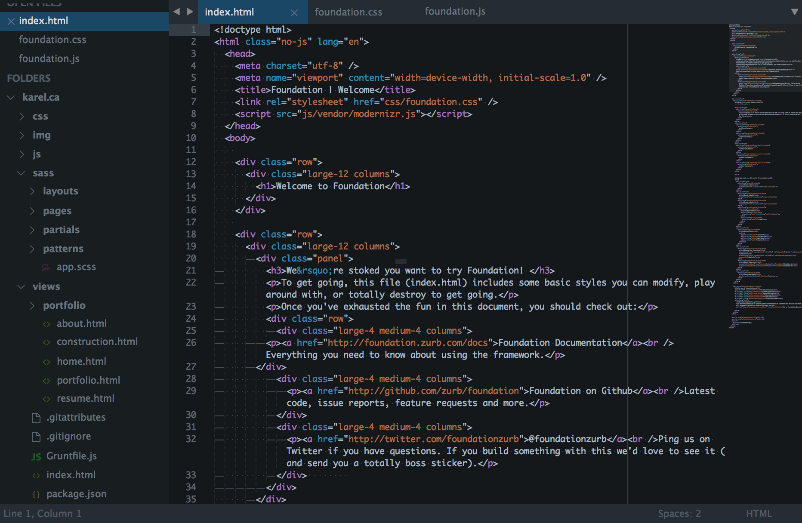
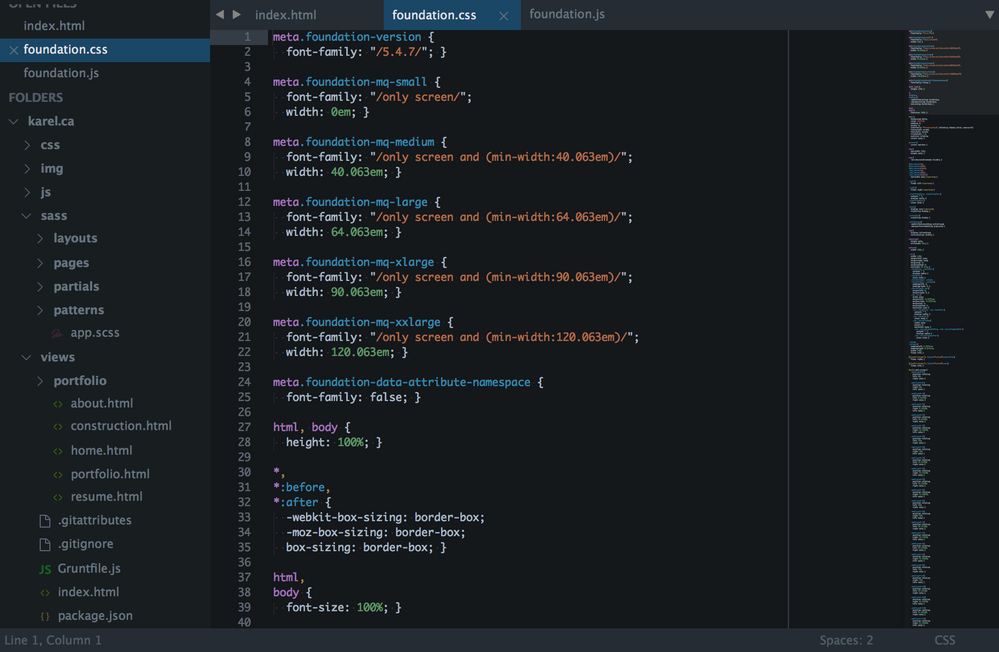
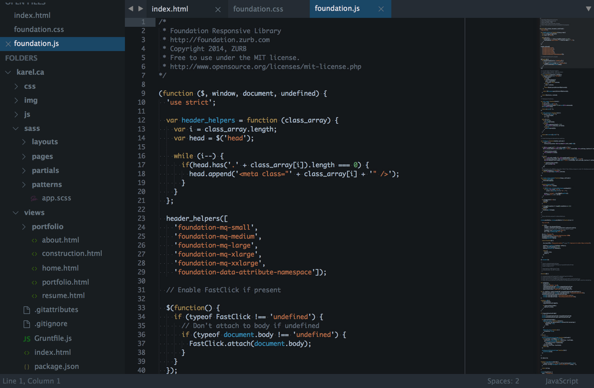

# Fox

A custom UI and syntax theme for Sublime Text 2/3. Based on Mozilla's Firefox Developer Edition and [@kkga](https://github.com/kkga)'s [Spacegray](https://github.com/kkga/spacegray).

***

### Themes

#### Fox

Default flavor based on Firefox Developer Edition - Dark.





*The font used in the screenshots is __Monaco__.*

***

### How to Install

#### Via Package Control

The easiest way to install is using [Sublime Package Control](https://sublime.wbond.net), where Fox is listed as `Theme - Fox`.

1. Open Command Palette using menu item `Tools -> Command Palette...` (<kbd>⇧</kbd><kbd>⌘</kbd><kbd>P</kbd> on Mac)
2. Choose `Package Control: Install Package`
3. Find `Theme - Fox` and hit <kbd>Enter</kbd>

#### Manual

You can also install the theme manually:

1. [Download the .zip](https://github.com/karelvuong/fox/archive/master.zip)
2. Unzip and rename the folder to `Theme - Fox`
3. Copy the folder into `Packages` directory, which you can find using the menu item `Sublime Text -> Preferences -> Browse Packages...`

***

### How to Activate

Activate the UI theme and color scheme by modifying your user preferences file, which you can find using the menu item `Sublime Text -> Preferences -> Settings - User` (<kbd>⌘</kbd><kbd>,</kbd> on Mac).

You can choose whichever flavor you like, but don't forget to change *both* color scheme and UI theme so they match.

***Note: Don't forget to restart Sublime Text after activating the theme.***

#### Settings for Fox

```json
{
  "theme": "Fox.sublime-theme",
  "color_scheme": "Packages/Theme - Fox/fox.dark.tmTheme"
}
```

***

### Thanks

- Layout, structure, and base icons by [@kkga](https://github.com/kkga/)'s [Spacegray](https://github.com/kkga/spacegray)
- File type icons compiled by [@kurtextrem](https://github.com/kurtextrem) from [Seti_ST3](https://github.com/ctf0/Seti_ST3), [Soda Theme](https://github.com/pryley/soda-theme), [Aprosopo](https://github.com/facelessuser/Aprosopo)
